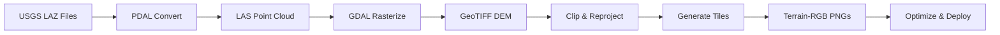

# DEM Data Pipeline Implementation Guide

## Overview

This guide provides step-by-step instructions for implementing the DEM (Digital Elevation Model) data processing pipeline that converts USGS LIDAR data into web-ready Terrain-RGB tiles.

## Pipeline Architecture



## Step 1: Download Infrastructure

### 1.1 Create Download Script

`scripts/download-dem.js`:

```javascript
#!/usr/bin/env node
const https = require("https");
const fs = require("fs");
const path = require("path");
const { pipeline } = require("stream/promises");
const ProgressBar = require("progress");

const USGS_BASE_URL =
  "https://prd-tnm.s3.amazonaws.com/StagedProducts/Elevation/LPC/Projects/";
const SF_2020_PATH = "CA_SanFrancisco_2020_D20/LAZ/";

const SF_TILES = [
  "USGS_LPC_CA_SanFrancisco_2020_02skc3805_LAS_2021.laz",
  "USGS_LPC_CA_SanFrancisco_2020_02skc3905_LAS_2021.laz",
  // Add all tile names from USGS metadata
];

async function downloadFile(url, destPath) {
  return new Promise((resolve, reject) => {
    const file = fs.createWriteStream(destPath);

    https
      .get(url, (response) => {
        const totalSize = parseInt(response.headers["content-length"], 10);
        const progressBar = new ProgressBar(
          "Downloading [:bar] :percent :etas",
          {
            complete: "█",
            incomplete: "░",
            width: 40,
            total: totalSize,
          }
        );

        response.on("data", (chunk) => progressBar.tick(chunk.length));
        response.pipe(file);

        file.on("finish", () => {
          file.close();
          resolve();
        });
      })
      .on("error", reject);
  });
}

async function main() {
  const dataDir = path.join(__dirname, "../data/raw");
  fs.mkdirSync(dataDir, { recursive: true });

  for (const tile of SF_TILES) {
    const url = `${USGS_BASE_URL}${SF_2020_PATH}${tile}`;
    const destPath = path.join(dataDir, tile);

    if (fs.existsSync(destPath)) {
      console.log(`✓ ${tile} already downloaded`);
      continue;
    }

    console.log(`Downloading ${tile}...`);
    await downloadFile(url, destPath);
    console.log(`✓ Downloaded ${tile}`);
  }
}

main().catch(console.error);
```

### 1.2 Add Progress and Retry Logic

```javascript
const MAX_RETRIES = 3;
const RETRY_DELAY = 5000;

async function downloadWithRetry(url, destPath, attempt = 1) {
  try {
    await downloadFile(url, destPath);
  } catch (error) {
    if (attempt < MAX_RETRIES) {
      console.log(
        `Retry ${attempt}/${MAX_RETRIES} in ${RETRY_DELAY / 1000}s...`
      );
      await new Promise((resolve) => setTimeout(resolve, RETRY_DELAY));
      return downloadWithRetry(url, destPath, attempt + 1);
    }
    throw error;
  }
}
```

## Step 2: Docker Processing Environment

### 2.1 Create Dockerfile

`Dockerfile.processing`:

```dockerfile
FROM osgeo/gdal:alpine-normal-latest

# Install dependencies
RUN apk add --no-cache \
    python3 \
    py3-pip \
    nodejs \
    npm \
    git \
    cmake \
    make \
    g++ \
    boost-dev

# Install PDAL
RUN git clone https://github.com/PDAL/PDAL.git && \
    cd PDAL && \
    mkdir build && \
    cd build && \
    cmake .. && \
    make -j$(nproc) && \
    make install

# Install Node dependencies
WORKDIR /app
COPY package.json ./
RUN npm install

# Copy scripts
COPY scripts/ ./scripts/

ENTRYPOINT ["node"]
```

### 2.2 Docker Compose Setup

`docker-compose.yml`:

```yaml
version: "3.8"

services:
  processor:
    build:
      context: .
      dockerfile: Dockerfile.processing
    volumes:
      - ./data:/data
      - ./scripts:/app/scripts
      - ./public/tiles:/output
    environment:
      - NODE_ENV=production
    command: scripts/process-dem.js
```

## Step 3: LAZ to GeoTIFF Conversion

### 3.1 Process DEM Script

`scripts/process-dem.js`:

```javascript
#!/usr/bin/env node
const { exec } = require("child_process");
const { promisify } = require("util");
const fs = require("fs").promises;
const path = require("path");
const yargs = require("yargs");

const execAsync = promisify(exec);

const argv = yargs
  .option("city", {
    alias: "c",
    description: "City to process",
    type: "string",
    default: "sf",
  })
  .option("bounds", {
    alias: "b",
    description: "Bounding box: west,south,east,north",
    type: "string",
    default: "-122.5155,37.7034,-122.3557,37.8324",
  })
  .help().argv;

// San Francisco bounds
const CITY_BOUNDS = {
  sf: {
    west: -122.5155,
    south: 37.7034,
    east: -122.3557,
    north: 37.8324,
  },
};

async function convertLAZtoLAS(inputPath, outputPath) {
  console.log(`Converting ${path.basename(inputPath)} to LAS...`);

  const pdalPipeline = {
    pipeline: [
      {
        type: "readers.las",
        filename: inputPath,
      },
      {
        type: "writers.las",
        filename: outputPath,
        minor_version: 4,
        dataformat_id: 6,
      },
    ],
  };

  const pipelinePath = `/tmp/pipeline_${Date.now()}.json`;
  await fs.writeFile(pipelinePath, JSON.stringify(pdalPipeline));

  await execAsync(`pdal pipeline ${pipelinePath}`);
  await fs.unlink(pipelinePath);
}

async function mergeAndRasterize(lasFiles, outputTiff) {
  console.log("Merging LAS files and creating DEM...");

  const bounds = CITY_BOUNDS[argv.city];
  const resolution = 1.0; // 1 meter

  // Create VRT (Virtual Raster) from all LAS files
  const vrtPath = "/tmp/merged.vrt";
  const lasFileList = lasFiles.join(" ");

  await execAsync(`
    gdalbuildvrt -resolution highest \
    -te ${bounds.west} ${bounds.south} ${bounds.east} ${bounds.north} \
    ${vrtPath} ${lasFileList}
  `);

  // Rasterize to GeoTIFF
  await execAsync(`
    gdal_rasterize -l merged \
    -burn 1.0 \
    -tr ${resolution} ${resolution} \
    -a_nodata -9999.0 \
    -te ${bounds.west} ${bounds.south} ${bounds.east} ${bounds.north} \
    -ot Float32 \
    -of GTiff \
    ${vrtPath} ${outputTiff}
  `);
}

async function processCity() {
  const rawDir = path.join(__dirname, "../data/raw");
  const processedDir = path.join(__dirname, "../data/processed");

  await fs.mkdir(processedDir, { recursive: true });

  // Find all LAZ files
  const lazFiles = await fs.readdir(rawDir);
  const cityLazFiles = lazFiles.filter((f) => f.endsWith(".laz"));

  console.log(`Found ${cityLazFiles.length} LAZ files`);

  // Convert each LAZ to LAS
  const lasFiles = [];
  for (const lazFile of cityLazFiles) {
    const inputPath = path.join(rawDir, lazFile);
    const outputPath = path.join(processedDir, lazFile.replace(".laz", ".las"));

    await convertLAZtoLAS(inputPath, outputPath);
    lasFiles.push(outputPath);
  }

  // Merge and create DEM
  const demPath = path.join(processedDir, `${argv.city}_dem.tif`);
  await mergeAndRasterize(lasFiles, demPath);

  console.log(`✓ DEM created: ${demPath}`);

  // Cleanup LAS files to save space
  for (const lasFile of lasFiles) {
    await fs.unlink(lasFile);
  }
}

processCity().catch(console.error);
```

## Step 4: Terrain-RGB Tile Generation

### 4.1 Tile Generation Script

`scripts/generate-tiles.js`:

```javascript
#!/usr/bin/env node
const sharp = require("sharp");
const { exec } = require("child_process");
const { promisify } = require("util");
const fs = require("fs").promises;
const path = require("path");
const SphericalMercator = require("@mapbox/sphericalmercator");

const execAsync = promisify(exec);
const merc = new SphericalMercator({ size: 256 });

// Terrain-RGB encoding
function elevationToRGB(elevation) {
  // Shift elevation to positive range
  const shifted = elevation + 10000;

  // Scale to 0.1m precision
  const scaled = Math.round(shifted / 0.1);

  // Encode into RGB
  const r = Math.floor(scaled / (256 * 256));
  const g = Math.floor((scaled % (256 * 256)) / 256);
  const b = scaled % 256;

  return { r, g, b };
}

async function generateTilesForZoom(inputTiff, outputDir, zoom) {
  console.log(`Generating tiles for zoom ${zoom}...`);

  // Get bounds from GeoTIFF
  const { stdout } = await execAsync(`gdalinfo -json ${inputTiff}`);
  const info = JSON.parse(stdout);
  const bounds = info.cornerCoordinates;

  // Calculate tile range
  const minTile = merc.xyz([bounds.lowerLeft[0], bounds.lowerLeft[1]], zoom);
  const maxTile = merc.xyz([bounds.upperRight[0], bounds.upperRight[1]], zoom);

  const tiles = [];
  for (let x = minTile.minX; x <= maxTile.maxX; x++) {
    for (let y = minTile.minY; y <= maxTile.maxY; y++) {
      tiles.push({ x, y, z: zoom });
    }
  }

  console.log(`Processing ${tiles.length} tiles at zoom ${zoom}`);

  // Process tiles in batches
  const BATCH_SIZE = 10;
  for (let i = 0; i < tiles.length; i += BATCH_SIZE) {
    const batch = tiles.slice(i, i + BATCH_SIZE);
    await Promise.all(
      batch.map((tile) => generateTile(inputTiff, outputDir, tile))
    );

    const progress = Math.round((i / tiles.length) * 100);
    process.stdout.write(`\rProgress: ${progress}%`);
  }

  console.log("\n✓ Zoom level complete");
}

async function generateTile(inputTiff, outputDir, { x, y, z }) {
  const tileBounds = merc.bbox(x, y, z);
  const tileDir = path.join(outputDir, String(z), String(x));
  const tilePath = path.join(tileDir, `${y}.png`);

  await fs.mkdir(tileDir, { recursive: true });

  // Extract tile from GeoTIFF
  const tempTiff = `/tmp/tile_${z}_${x}_${y}.tif`;

  await execAsync(`
    gdal_translate -of GTiff \
    -projwin ${tileBounds[0]} ${tileBounds[3]} ${tileBounds[2]} ${tileBounds[1]} \
    -outsize 256 256 \
    ${inputTiff} ${tempTiff}
  `);

  // Read elevation data
  const { stdout } = await execAsync(
    `gdal_translate -of AAIGrid ${tempTiff} /vsistdout/`
  );
  const lines = stdout.split("\n");
  const data = [];

  // Parse ASCII grid
  let inData = false;
  for (const line of lines) {
    if (inData) {
      const values = line.trim().split(/\s+/).map(Number);
      if (values.length > 0 && !isNaN(values[0])) {
        data.push(...values);
      }
    } else if (line.startsWith("NODATA_value")) {
      inData = true;
    }
  }

  // Create RGB image
  const pixels = new Uint8ClampedArray(256 * 256 * 3);

  for (let i = 0; i < data.length; i++) {
    const elevation = data[i];
    const { r, g, b } = elevationToRGB(elevation);

    pixels[i * 3] = r;
    pixels[i * 3 + 1] = g;
    pixels[i * 3 + 2] = b;
  }

  // Save as PNG
  await sharp(pixels, {
    raw: {
      width: 256,
      height: 256,
      channels: 3,
    },
  })
    .png({ compressionLevel: 9 })
    .toFile(tilePath);

  // Cleanup
  await fs.unlink(tempTiff);
}

async function main() {
  const inputTiff = path.join(__dirname, "../data/processed/sf_dem.tif");
  const outputDir = path.join(__dirname, "../public/tiles/sf");

  // Generate tiles for zoom levels 10-15
  for (let zoom = 10; zoom <= 15; zoom++) {
    await generateTilesForZoom(inputTiff, outputDir, zoom);
  }

  // Generate metadata
  const metadata = {
    bounds: [-122.5155, 37.7034, -122.3557, 37.8324],
    minzoom: 10,
    maxzoom: 15,
    format: "terrain-rgb",
    generated: new Date().toISOString(),
  };

  await fs.writeFile(
    path.join(outputDir, "metadata.json"),
    JSON.stringify(metadata, null, 2)
  );

  console.log("✓ Tile generation complete!");
}

main().catch(console.error);
```

### 4.2 Tile Validation Script

`scripts/validate-tiles.js`:

```javascript
#!/usr/bin/env node
const fs = require("fs").promises;
const path = require("path");
const sharp = require("sharp");

async function validateTile(tilePath) {
  try {
    const metadata = await sharp(tilePath).metadata();

    if (metadata.width !== 256 || metadata.height !== 256) {
      throw new Error(
        `Invalid dimensions: ${metadata.width}x${metadata.height}`
      );
    }

    if (metadata.channels !== 3) {
      throw new Error(`Invalid channels: ${metadata.channels}`);
    }

    return true;
  } catch (error) {
    console.error(`Invalid tile ${tilePath}: ${error.message}`);
    return false;
  }
}

async function validateAllTiles() {
  const tilesDir = path.join(__dirname, "../public/tiles/sf");
  let totalTiles = 0;
  let validTiles = 0;

  for (let z = 10; z <= 15; z++) {
    const zoomDir = path.join(tilesDir, String(z));

    try {
      const xDirs = await fs.readdir(zoomDir);

      for (const x of xDirs) {
        const xDir = path.join(zoomDir, x);
        const tiles = await fs.readdir(xDir);

        for (const tile of tiles) {
          if (tile.endsWith(".png")) {
            totalTiles++;
            const tilePath = path.join(xDir, tile);

            if (await validateTile(tilePath)) {
              validTiles++;
            }
          }
        }
      }
    } catch (error) {
      console.error(`Error reading zoom ${z}: ${error.message}`);
    }
  }

  console.log(`\nValidation complete:`);
  console.log(`Total tiles: ${totalTiles}`);
  console.log(`Valid tiles: ${validTiles}`);
  console.log(`Invalid tiles: ${totalTiles - validTiles}`);

  return validTiles === totalTiles;
}

validateAllTiles().then((success) => {
  process.exit(success ? 0 : 1);
});
```

## Step 5: Pipeline Orchestration

### 5.1 Main Ingest Script

`scripts/ingest.js`:

```javascript
#!/usr/bin/env node
const { spawn } = require("child_process");
const path = require("path");
const yargs = require("yargs");

const argv = yargs
  .command("$0 [city]", "Process DEM data for a city", (yargs) => {
    yargs.positional("city", {
      describe: "City code to process",
      default: "sf",
    });
  })
  .option("skip-download", {
    describe: "Skip download step",
    type: "boolean",
    default: false,
  })
  .option("skip-processing", {
    describe: "Skip processing step",
    type: "boolean",
    default: false,
  })
  .option("skip-tiles", {
    describe: "Skip tile generation",
    type: "boolean",
    default: false,
  })
  .help().argv;

async function runStep(name, script, args = []) {
  console.log(`\n${"=".repeat(50)}`);
  console.log(`Running: ${name}`);
  console.log(`${"=".repeat(50)}\n`);

  return new Promise((resolve, reject) => {
    const child = spawn("node", [script, ...args], {
      stdio: "inherit",
      cwd: path.dirname(script),
    });

    child.on("exit", (code) => {
      if (code === 0) {
        resolve();
      } else {
        reject(new Error(`${name} failed with code ${code}`));
      }
    });
  });
}

async function main() {
  const startTime = Date.now();

  try {
    // Step 1: Download
    if (!argv.skipDownload) {
      await runStep(
        "Download DEM data",
        path.join(__dirname, "download-dem.js"),
        ["--city", argv.city]
      );
    }

    // Step 2: Process
    if (!argv.skipProcessing) {
      await runStep(
        "Process DEM to GeoTIFF",
        path.join(__dirname, "process-dem.js"),
        ["--city", argv.city]
      );
    }

    // Step 3: Generate tiles
    if (!argv.skipTiles) {
      await runStep(
        "Generate Terrain-RGB tiles",
        path.join(__dirname, "generate-tiles.js"),
        ["--city", argv.city]
      );
    }

    // Step 4: Validate
    await runStep("Validate tiles", path.join(__dirname, "validate-tiles.js"));

    const duration = Math.round((Date.now() - startTime) / 1000);
    console.log(`\n✅ Pipeline complete in ${duration} seconds!`);
  } catch (error) {
    console.error(`\n❌ Pipeline failed: ${error.message}`);
    process.exit(1);
  }
}

main();
```

## Step 6: Package.json Scripts

Add to `package.json`:

```json
{
  "scripts": {
    "ingest": "node scripts/ingest.js",
    "ingest:sf": "node scripts/ingest.js sf",
    "ingest:download": "node scripts/download-dem.js",
    "ingest:process": "node scripts/process-dem.js",
    "ingest:tiles": "node scripts/generate-tiles.js",
    "ingest:validate": "node scripts/validate-tiles.js",
    "ingest:docker": "docker-compose run processor scripts/ingest.js"
  }
}
```

## Usage Instructions

### Full Pipeline Run

```bash
# Run complete pipeline for San Francisco
pnpm ingest:sf

# Run with Docker
pnpm ingest:docker
```

### Individual Steps

```bash
# Just download data
pnpm ingest:download

# Process existing data
pnpm ingest:process

# Generate tiles from processed DEM
pnpm ingest:tiles

# Validate tile output
pnpm ingest:validate
```

### Skip Steps

```bash
# Skip download (use existing data)
pnpm ingest sf --skip-download

# Skip processing (use existing GeoTIFF)
pnpm ingest sf --skip-download --skip-processing
```

## Troubleshooting

### Memory Issues

If processing fails with memory errors:

1. Increase Docker memory limit to 8GB+
2. Process smaller areas first
3. Use `--max-old-space-size` flag:
   ```bash
   node --max-old-space-size=8192 scripts/process-dem.js
   ```

### Missing Dependencies

```bash
# Install all processing dependencies
pnpm add progress yargs @mapbox/sphericalmercator sharp

# Install GDAL locally (macOS)
brew install gdal

# Install PDAL locally (macOS)
brew install pdal
```

### Validation Failures

If tiles fail validation:

1. Check source DEM for gaps
2. Verify bounds are correct
3. Inspect failed tiles visually
4. Re-run tile generation for specific zoom levels

## Performance Tips

1. **Parallel Processing**: Process multiple zoom levels in parallel
2. **SSD Storage**: Use SSD for temp files
3. **Batch Operations**: Process tiles in batches to avoid file handle limits
4. **Compression**: Use maximum PNG compression for smaller files
5. **Cleanup**: Delete intermediate files to save space

## Next Steps

After successful tile generation:

1. Verify tiles load in map viewer
2. Test elevation queries
3. Optimize tile serving (CDN, caching)
4. Document tile URL structure
5. Create backup of processed tiles
